# 🏗️ Claso Architecture Documentation

## 📋 Table of Contents
- [System Overview](#system-overview)
- [Project Structure](#project-structure)
- [Model Architecture](#model-architecture)
- [API Architecture](#api-architecture)
- [Data Pipeline](#data-pipeline)
- [Training Pipeline](#training-pipeline)
- [Frontend Architecture](#frontend-architecture)
- [Deployment Architecture](#deployment-architecture)

## 🎯 System Overview

Claso is a production-ready AI system that generates intelligent code comments and commit messages using custom-trained transformer models.

## 📁 Project Structure

## 🧠 Model Architecture

### FastEnhancedTransformer Architecture

### Model Variants Comparison

```mermaid
graph LR
    subgraph "Comment Models"
        LIGHT_COMMENT[Lightweight<br/>4.8M params<br/>d_model=128<br/>layers=2+2]
        FAST_COMMENT[Fast Enhanced<br/>15M params<br/>d_model=256<br/>layers=4+4]
        FULL_COMMENT[Full Enhanced<br/>50M params<br/>d_model=512<br/>layers=8+8]
    end
    
    subgraph "Commit Models"
        LIGHT_COMMIT[Lightweight<br/>11.7M params<br/>d_model=256<br/>layers=4+4]
        FAST_COMMIT[Fast Enhanced<br/>25M params<br/>d_model=384<br/>layers=5+5]
        FULL_COMMIT[Full Enhanced<br/>80M params<br/>d_model=768<br/>layers=10+10]
    end
    
    subgraph "Performance"
        SPEED[Training Speed<br/>30min → 1hr → 2hr]
        QUALITY[Output Quality<br/>Good → Better → Best]
        MEMORY[Memory Usage<br/>50MB → 150MB → 300MB]
    end
    
    LIGHT_COMMENT --> SPEED
    FAST_COMMENT --> SPEED
    FULL_COMMENT --> SPEED
    
    LIGHT_COMMIT --> QUALITY
    FAST_COMMIT --> QUALITY
    FULL_COMMIT --> QUALITY
    
    style FAST_COMMENT fill:#e8f5e8
    style FAST_COMMIT fill:#e8f5e8
    style SPEED fill:#fff3e0
    style QUALITY fill:#f3e5f5
```

## 🌐 API Architecture

### REST API Endpoints

### API Request/Response Flow

## 📊 Data Pipeline

### Data Collection & Processing

### Data Quality Pipeline

## 🎓 Training Pipeline

### Training Architecture

### Training Options Comparison

```mermaid
graph TD
    subgraph "Training Scripts"
        FAST[fast_enhanced_train.py<br/>1-1.5 hours<br/>15M/25M params]
        SMART[smart_enhanced_train.py<br/>Adaptive<br/>Auto-sizing]
        FULL[train_enhanced.py<br/>2-3 hours<br/>50M/80M params]
    end
    
    subgraph "Performance Trade-offs"
        SPEED[Training Speed<br/>Fast → Smart → Full]
        QUALITY[Model Quality<br/>Good → Better → Best]
        MEMORY[Memory Usage<br/>Low → Medium → High]
    end
    
    subgraph "Use Cases"
        DEMO[Quick Demos<br/>Prototyping]
        PRODUCTION[Production Use<br/>Balanced Performance]
        RESEARCH[Research<br/>Maximum Quality]
    end
    
    FAST --> SPEED
    SMART --> SPEED
    FULL --> SPEED
    
    FAST --> QUALITY
    SMART --> QUALITY
    FULL --> QUALITY
    
    FAST --> DEMO
    SMART --> PRODUCTION
    FULL --> RESEARCH
    
    style FAST fill:#c8e6c9
    style SMART fill:#e8f5e8
    style PRODUCTION fill:#fff3e0
```

## 🎨 Frontend Architecture

### React Component Structure

### User Interaction Flow

## 🚀 Deployment Architecture

### Development Environment

### Production Deployment

### CI/CD Pipeline

---

## 📚 Additional Resources

- **API Documentation**: [Interactive API Docs](http://localhost:8000/docs)
- **Model Information**: [Model Info Endpoint](http://localhost:8000/model-info)
- **Training Guide**: [TRAINING.md](backend/TRAINING.md)
- **Hackathon Submission**: [HACKATHON_SUBMISSION.md](HACKATHON_SUBMISSION.md)

---

**Built with ❤️ for developers who deserve better documentation tools!** 🚀